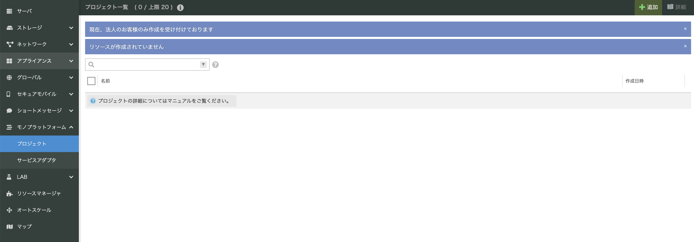

# 概要

- さくらのモノプラットフォーム（以下「モノプラ」）と双方向通信を行うWebアプリケーションの実装例です
- モノプラ→WebアプリケーションはOutgoing Webhookを利用します
- Webアプリケーション→モノプラはIncoming Webhookを利用します
- 下記に動作イメージを図示します


- Outgoing WebhookとWebアプリケーション間のデータフォーマット詳細は[こちら](https://manual.sakura.ad.jp/cloud/iotpf/service-adapter/data-format.html) をご参照ください
  - Outgoing Webhookのリクエストボディの改ざんチェックは本Webアプリケーション実装例では対応しておりません
- WebアプリケーションからIncoming Webhookに対しては、下記のJSONのメッセージが固定で送信されます

```json
{
    "device_id": "USER_DEVICE_ID",
    "type": "object",
    "payload": [
        {
            "type": "string.utf8",
            "tag": "FF",
            "value": "message_from_server"
        }
    ]
}
```

# 動作環境

- Python 3.9.0
- Pipenv 2020.11.15

# 想定利用者

- Python,Pipenvの利用経験
- Flaskなどの軽量Webアプリケーションフレームワークの利用経験
- [標準ファームウェアにしたがってデバイスアダプタにメッセージ送受信ができること](https://github.com/sakura-internet/sipf-std-client_nrf9160/wiki/object_client)

# 必要機材など

- [さくらのセキュアモバイルコネクトのSIM](https://iot.sakura.ad.jp/sim/)を搭載した以下の機材が必要です
  - [リンク先モノプラットフォームマニュアルに記載済みの機材一覧](https://manual.sakura.ad.jp/cloud/iotpf-beta/getting-started/gs-scmltem1nrf-beta.html?highlight=%E3%83%95%E3%82%A1%E3%83%BC%E3%83%A0%E3%82%A6%E3%82%A7%E3%82%A2#id3)
- さくらのクラウドなどで構築したインターネットからアクセス可能なホストマシン

# 導入手順と動作確認

### 1. ホストマシンの準備・動作確認

- インターネットからアクセス可能なホストマシンを用意します
- 本リポジトリをホストマシン上にgit clone、もしくはダウンロードしてください
- Python3.9.0,Pipenvをインストールします
- 動作確認のため、下記コマンドを実行しWebアプリケーションを起動します

```bash
$ cd sipf-example-cloudapps/python/incoming-outgoing
$ ls
Pipfile Pipfile.lock README.md constants.py db.py images templates test_web_app.py web_app.py
$ pipenv install
$ pipenv shell

(incoming-outgoing)$ python web_app.py
```

- ウェブブラウザから`http://<ホストマシンのIPアドレス>:5000`にアクセスし、下のような画面が表示されることを確認します


- 画面が確認できたら、Webアプリケーションを終了します

### 2. プロジェクトの作成

「さくらのクラウド」へログインし、プロジェクトを作成します

- さくらのクラウドコントロールパネルより、「モノプラットフォーム」を選択し、「プロジェクト」をクリックします
- 「プロジェクト一覧」画面が表示されたら、右上の「追加」ボタンをクリックします



- プロジェクトに対して任意の名前を入力し、「作成」ボタンをクリックします
 


- 「プロジェクト」をクリックし、入力したプロジェクトが作成されていれば成功です

 

### 3. デバイスをプロジェクトに登録

手順2で作成したプロジェクトにデバイスを登録します

- さくらのクラウドコントロールパネルより、「セキュアモバイル」を選択し、「SIM」をクリックします
- 「SIM一覧」画面が表示されたら、右上の「追加」をクリックします


- SIMの追加画面より、ICCID、PASSCODEを入力の上、「接続先」を「モノプラットフォーム」、「プロジェクト」を手順2で作成したプロジェクトを選択し「作成」をクリックします。
- SIMの登録については[こちら](https://manual.sakura.ad.jp/cloud/mobile-connect/getting-started.html#createsim)も同時にご参照ください


- さくらのクラウドコントロールパネルより、「モノプラットフォーム」を選択し、「プロジェクト」をクリックします
- 手順2で作成したプロジェクトをダブルクリックします


- プロジェクト詳細から「デバイス」タブをクリックします
 


- デバイス一覧から追加したデバイスが確認できたら成功です
- 画面に表示されている「デバイスID」を後の手順6で利用するので、控えてください


### 4. サービスアダプタ（Outgoing Webhook）の作成

- さくらのクラウドコントロールパネルより、「モノプラットフォーム」を選択し、「サービスアダプタ」をクリックします
- 「サービスアダプタ一覧」画面が表示されたら、右上の「追加」ボタンをクリックします


- Outgoing Webhookを作成し、`Payload URL`に`http://<ホストマシンのIPアドレス>:5000`を設定します
- サービスアダプタを「Outgoing Webhook」とし、「作成」をクリックします


- 「サービスアダプタ」より作成したサービスアダプタが確認できれば成功です


### 5. サービスアダプタ（Incoming Webhook）の作成

- さくらのクラウドコントロールパネルより、「モノプラットフォーム」を選択し、「サービスアダプタ」をクリックします
- 「サービスアダプタ一覧」画面が表示されたら、右上の「追加」ボタンをクリックします


- サービスアダプタ追加画面にて「プロジェクト」を手順3のプロジェクト、サービスアダプタを「Incoming Webhook」とし、「作成」をクリックします


 
- 「サービスアダプタ」より作成したサービスアダプタが確認できれば成功です
- この際に作成したトークンを後の手順で利用します


### 6. Webアプリケーションの起動

- ホストマシン内で、以下の条件でWebアプリケーションを起動します
  - `サービスアダプタの作成で控えたデバイスID`を`DEVICE_ID`に環境変数として渡します
  - `Incoming Webhook の作成で控えたトークン`を`INCOMING_TOKEN`に環境変数として渡します

```bash
$ pipenv shell
(incoming-outgoing)$ DEVICE_ID="<デバイスID>" INCOMING_TOKEN="<トークン>" python web_app.py
```

### 7. サービスアダプタ(WebSocket)の作成

- さくらのクラウドコントロールパネルより、「モノプラットフォーム」を選択し、「サービスアダプタ」をクリックします
- 「サービスアダプタ一覧」画面が表示されたら、右上の「追加」ボタンをクリックします


- サービスアダプタ追加画面にて「プロジェクト」を手順3のプロジェクト、サービスアダプタを「WebSocket」とし、「作成」をクリックします


- 「サービスアダプタ」より作成したサービスアダプタが確認できれば成功です


### 8. デバイス→Webアプリケーションへのメッセージ送信

#### 8.1 デバイス→モノプラへのメッセージ到達の確認

デバイスからモノプラへメッセージの送信を行います

- 手順7で作成したWebSocketのサービスアダプタ詳細を開いてください
- デバイスからメッセージ送信を行ってください
- デバイスからメッセージ送信に成功している場合、下記のようにメッセージが流れていることが確認できます


#### 8.2 モノプラ→Webアプリケーションへのメッセージ到達の確認

Webアプリケーションがモノプラから受け取ったメッセージを確認します

- `http://<ホストマシンのIPアドレス>:5000`を開くと、以下のように到達したメッセージの一覧が閲覧可能です
  - 新規メッセージの受信を確認するにはウェブブラウザをリロードしてください


### 9. Webアプリケーション→モノプラへのメッセージの到達の確認

モノプラのOutgoing WebhookからWebアプリケーションがメッセージを受信したら、Incoming Webhookに対して下記の固定メッセージが送信されます    

```json
{
  "device_id": "USER_DEVICE_ID",
  "type": "object",
  "payload": [
    {
      "type": "string.utf8",
      "tag": "FF",
      "value": "message_from_server"
    }
  ]
}
```

正常にメッセージを送信できた場合、Webアプリケーションサーバのコンソールに`Message successfully sent`というログが表示されます   
メッセージ送信後にデバイスからメッセージ受信処理を行うと、Webアプリケーションから送信されたメッセージを確認できます

# ユニットテストの実行

ホストマシン内で、以下のコマンドでWebアプリケーションのユニットテストを実行します    
ユニットテストは、データベースへの作成・レコードの保存・レコードの参照・メッセージの送受信を確認します    

```bash
 (incoming-outgoing)$ python test_web_app.py
...
----------------------------------------------------------------------
Ran 4 tests in 0.036s

OK
```